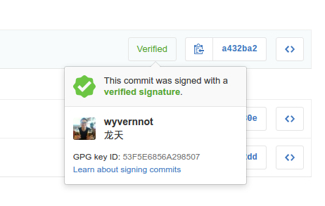

# 怎样为你的 Commit 加上 GPG 的签名



> 开源赋予了每个人贡献代码的权利，要提高开源软件整体的安全性需要从一个个提交开始。
> 为 Commit 带上 GPG 的签名就是一个很好的开始，它能够在一定程度上保证安全性。
> GPG 是一个非常出色的加密软件。当年斯诺登就是用 GPG 把大量的绝密文件发送给了记者。
> 本文以 Ubuntu 为例，介绍怎样为你的 Commit 加上 GPG 的签名。

## 环境配置

注意只有 `git` 2.0 及以后的版本才支持 `GPG` 签名。

**查看 git 版本：**

```sh
~$ git --version
git version 2.8.2
```

**确保 `git` 是 `2.x` 版本** 如果需要可以执行下面的命令升级:

```sh
sudo add-apt-repository ppa:git-core/ppa
sudo apt-get update
sudo apt-get install git
```

**查看 GPG 是否安装**

```sh
~$ gpg --version
gpg (GnuPG) 1.4.16
Copyright (C) 2013 Free Software Foundation, Inc.
License GPLv3+: GNU GPL version 3 or later <http://gnu.org/licenses/gpl.html>
This is free software: you are free to change and redistribute it.
There is NO WARRANTY, to the extent permitted by law.
```

系统里一般都已经装上了 `GPG`，如果没有可以 **手动安装 GnuPG**

```sh
sudo apt-get install gnupg
```

确保 `git` 和 `GNU` 都安装成功就可以开始下一步了。

## 生成 GPG Key

命令行输入：

```sh
gpg --gen-key
```

生成过程中需要输入一些信息：

- 加密算法 推荐选择 `RSA`
- 密匙长度 推荐选择 `4096`
- 过期时间 推荐选择 `1y` 也就是一年
- 名字 可以随便填
- 邮箱 需要是 Github 认证过的邮箱
- 注释 可以随便填

最后需要输入一个密码，类似于保护 `SSH` 证书的密码，可以留空，不过最好是填上。

接下来是漫长的生成过程，在等待的过程里可以多移动鼠标，多打开几个网页，以此来增加机器的随机性。

## 查看 GPG Key ID

`GPG Key ID` 是一个8位的字符串，对应着一个 `GPG Key`

在命令行里查看 `GPG Key` 列表：

```sh
~$ gpg --list-keys
/home/***/.gnupg/pubring.gpg
----------------------------
pub   4096R/6******7 2016-05-11 [expires: 2017-05-11]
uid                  Wang Yan <wyvernnot@gmail.com>
sub   4096R/B******E 2016-05-11 [expires: 2017-05-11]
```

输出结果里的 6******7 就是这个 `GPG Key ID`

## 导出 GPG 公匙

执行命令：

```sh
gpg --armor --export 6******7
```

会在命令行看到公匙的文本：

```txt
-----BEGIN PGP PUBLIC KEY BLOCK-----
Version: GnuPG v1

mQINBFczB1kBEAC3afc50p08I7knynnm4ea/8VZy42zGH/qrIWoInqT8HbgwLb9s
TrulTgLMbMTTOhl4zqFtTR52ZTwfLOtnV8tCM62ZNqO6z0nd0bFPA7HVp5t9z4a5
qBF3l3AZO5TFjn8gTsxatpVf5Ug9gmkEOCAejwSPFKNvfAun+WSLZ19LaFcorrj1
                          ...
cOyj7VNdmx1//BMp/5A6SEqJFkkLxebaJpcrv1dm1HvKGU8vty3JAdWgOjY5VVmn
nUaAr8D0uNquASkap4dki/zscK+tEJiH6HLnQGGtIf+fR2zoHAUfBvtTuUhq8w/Q
F0R/UVgc4Sg+Vz4gyYNJKO8BdTTTfvOZMDNFw4x70vXfhCZDm4QxgfUwRs//kkIh
Z3QylTf5xSk4
=kuFS
-----END PGP PUBLIC KEY BLOCK-----
```

拷贝这一大段到剪贴板，然后登录 `Github` 添加这个公匙，添加的入口在 `Settings` 下的 `SSH and GPG Keys` 里面。

## 配置 Git 启用 GPG 签名

首先设置 `Git` 默认使用的 `GPG Key ID`，就是上面那个 8 位的字符串。

```sh
git config --global user.signingkey 6******7
```

提交的时候加上一个 `-s` 参数就可以为提交签名：

```sh
git commit -S -m your commit message
```

要想以后如果每次提交都默认都开启 `GPG` 签名，尤其是使用 IDE 的情况下，需要修改 `git` 的一个全局设置项：

```sh
git config --global commit.gpgsign true
```

## 验证

执行 `git push` 后登录到 `Github`， 看看提交历史的右边是不是多了一个 `Verified` 图标。

如果看到下面的结果，那么恭喜你已经为整个开源世界的安全迈出了一小步！


## 后话

如果在 Github 上把 `GPG Public Key` 移除, 那么之前的 `Verified` 提交会变成 `Unverified`。

## 参考文章

- http://www.ruanyifeng.com/blog/2013/07/gpg.html
- https://www.gnupg.org/howtos/zh/index.html
- http://www.linuxidc.com/Linux/2014-11/109972.htm
- https://help.github.com/articles/generating-a-new-gpg-key/
- https://help.github.com/articles/adding-a-new-gpg-key-to-your-github-account/
- https://help.github.com/articles/telling-git-about-your-gpg-key/
- https://help.github.com/articles/signing-commits-using-gpg/